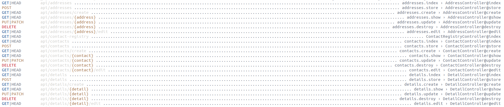
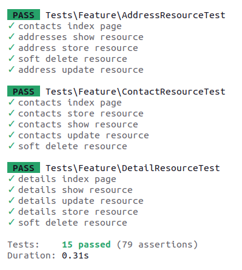

#### Used technologies:

 
- PHP 8.3.7 
- NVM 0.38.0
- Npm 10.2.4
- Node v20.11.0
- 8.0.36-0ubuntu0.22.04.1

#### Available routes

#### Implemented test

#### Installed packages

- composer require -W --dev laravel-shift/blueprint
- composer require larastan/larastan:^2.0 --dev
- composer require --dev phpstan/phpstan
- composer require laravel/pint --dev
- composer require juststeveking/http-status-code

#### Database structure

There is a copy of the exported database structure in the readme-file folder in the backup.sql file.
