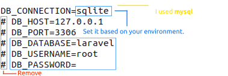
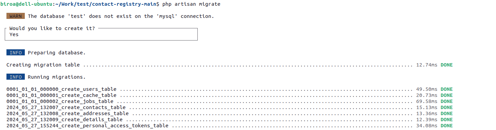

#### Used technologies:

 
- PHP 8.3.7 
- NVM 0.38.0
- Npm 10.2.4
- Node v20.11.0
- 8.0.36-0ubuntu0.22.04.1

#### Installed packages

- composer require -W --dev laravel-shift/blueprint
- composer require larastan/larastan:^2.0 --dev
- composer require --dev phpstan/phpstan
- composer require laravel/pint --dev
- composer require juststeveking/http-status-code

#### Database structure

There is a copy of the exported database structure in the readme-file folder in the backup.sql file.

#### Steps of configuring the application

- Git clone the repository or download the zip
- Rename or copy the .env.example as .env ( this will be your local environment config file )
  - 

 
  - Change the DB_CONNECTION to: mysql (I used mysql)
    - DB_CONNECTION=mysql
  - Set the following params based on your environment:
    - DB_HOST
    - DB_PORT
    - DB_DATABASE (Just give a unique name. You do not need to create it manually)
    - DB_USERNAME
    - DB_PASSWORD

###### Commands you need to run

- `sudo chmod 777 -R storage/ bootstrap/`
- `composer install`
- `php artisan migrate`
  - _It creates the database if it does not exist yet_
  - _It will run the migration files_
  - 

- `php artisan app:generate-example-data 5 4`
  - _This custom command generates {x} contacts, each with two addresses, and {y} pieces of detail._
  - `php artisan key:generate`
  - `php artisan serve`
    - _To launch the server_

###### You should be able to check and see the responses

| INDEX                 | SHOW                | STORE           | DELETE              | UPDATE              |
|-----------------------|:--------------------|:----------------|:--------------------|:--------------------|
| /api/contact-registry |                     |                 |                     |                     |
| /api/addresses        | /api/addresses/{id} | /api/addresses  | /api/addresses/{id} | /api/addresses/{id} |
| /api/contacts         | /api/contacts/{id}  | /api/contacts   | /api/contacts/{id}  | /api/contacts/{id}  |
| /api/details          | /api/details/{id}   | /api/details    | /api/details/{id}   | /api/details/{id}   |

#### Implemented test

- `php artisan test`
  - _it runs all the test and provide an output like this_ 

